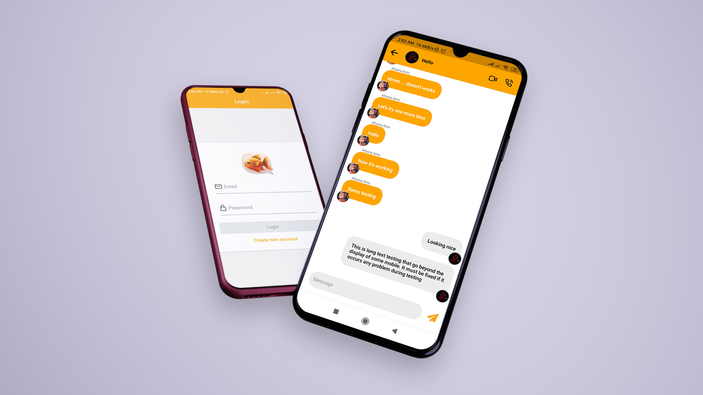

---

# Fishbook - A simple chatapp

A cross platform open source mobile messaging application made with **_React Native_** and **_Google Firebase_** and **_Firestore_** realtime database. This project is currently under development.

## Features

- Create group chat.
- Send text messages realtime.
- Send audio, video, and image (coming soon).
- Audio and video call (coming soon).

## Installation

**Fishbook** is currently under development. There are no release app for this project. But if you want to take a look at the latest development of this application, please follow the instructions below.

> Fishbook requires **_[Node.js](https://nodejs.org/) v14.18.1_** or higher and **_npm v9.2.0_** or higher to run. You also must have git installed in you machine.

### Upgrading npm

```sh
npm install -g@npm9.2.0
```

### Install expo client globally (Windows and Mac)

```sh
npm install -g expo-cli
```

### Install expo client in your Android or IOS device

> [Expo](https://play.google.com/store/apps/details?id=host.exp.exponent&hl=en&gl=US) - Android

> [Expo Go](https://apps.apple.com/us/app/expo-go/id982107779) - IOS

### Clone the repository and navigate to the project folder

```sh
git clone https://github.com/rezabtuhin/chatAppV3.git
cd chatAppV3
```

### Install Dependencies

```sh
npm install
```

### Run the project

```sh
npx expo start
```

or

```sh
npm start
```

Scan the QR code from the shell with the expo client from your Android or IOS device and you are good to go.

> **_Note:_** `ios` users may face issues regarding pod installation.

## Thank you!
